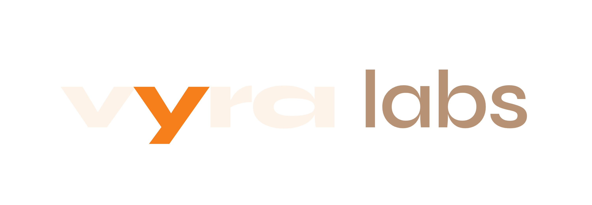

<p align="center">
  
</p>

<p align="center">
  Solana validator infrastructure, built in public.<br/>
  A landing page and a live validator status dashboard, fed by a read-only Rust collector on the validator box.
</p>

<p align="center">
  <a href="https://vyralabs.fun">Site</a> &nbsp;·&nbsp;
  <a href="https://vyralabs.fun/dashboard">Dashboard</a>
</p>

## What's in here

- **`src/`** — a Vite multi-page app with two entries sharing one design system:
  - Landing page: `index.html` → `src/App.tsx` (copy lives in `src/content.ts`).
  - Validator status dashboard: `dashboard.html` → `src/dashboard/` (a pure
    `parseSnapshot` seam, a polling hook, ECharts visualizations, and a
    LIVE → STALE → OFFLINE liveness model that degrades instead of blanking).
- **`collector/`** — a dependency-light Rust daemon that samples the validator
  read-only (`agave-validator monitor`, localhost RPC, `solana vote-account`, OS
  stats), assembles a size-bounded JSON snapshot via a pure `build_snapshot()`
  core, and publishes it for the dashboard to read. See `collector/deploy/RUN.md`.

## Stack

- Frontend: React, TypeScript, Vite (multi-page), Tailwind CSS v4, ECharts (lazy-loaded)
- Collector: Rust (serde, chrono, regex; no async runtime, no cloud SDKs)
- Hosting: Vercel (site), the validator box (collector)

## Development

```bash
npm install
npm run dev      # landing + dashboard (dashboard uses checked-in fixtures in dev)
npm run build    # tsc + vite build
npm run lint
```

Collector:

```bash
cd collector
cargo run -- --once     # dry-run over sample inputs, writes JSON locally
cargo build --release
```

## Layout

```
index.html            landing entry
dashboard.html        dashboard entry
src/
  App.tsx             landing page
  content.ts          landing copy
  dashboard/          status dashboard (parse seam, hooks, charts, components)
collector/            Rust status collector (build_snapshot core + fetch shell)
```

## Status

Personal infrastructure project, build-in-public. Not accepting external
contributions at the moment.
